# CustomQueue

Implementation of a Java Queue using a singly LinkedList.

# Time Complexity

| Method                          | V1 (Array-Backed) | V2 (Linked-List Based) | Winner |
|:--------------------------------|:-----------------:|:----------------------:|:------:|
| **`Constructor()`**             |      $O(1)$       |         $O(1)$         |  Tie   |
| **`Constructor(int capacity)`** |      $O(1)$       |         $O(1)$         |  Tie   |
| **`Constructor(Collection)`**   |      $O(N)$       |         $O(N)$         |  Tie   |
| **`add(E)`**                    |      $O(N)$       |         $O(1)$         |   V2   |
| **`offer(E)`**                  |      $O(N)$       |         $O(1)$         |   V2   |
| **`addAll(Collection)`**        |      $O(N)$       |         $O(N)$         |  Tie   |
| **`poll()`**                    |      $O(1)$       |         $O(1)$         |  Tie   |
| **`remove()`**                  |      $O(1)$       |         $O(1)$         |  Tie   |
| **`peek()`**                    |      $O(1)$       |         $O(1)$         |  Tie   |
| **`element()`**                 |      $O(1)$       |         $O(1)$         |  Tie   |
| **`size()`**                    |      $O(1)$       |         $O(1)$         |  Tie   |
| **`isEmpty()`**                 |      $O(1)$       |         $O(1)$         |  Tie   |
| **`clear()`**                   |      $O(N)$       |         $O(1)$         |   V2   |
| **`contains(Object)`**          |      $O(N)$       |         $O(N)$         |  Tie   |
| **`containsAll(Collection)`**   |    $O(N + M)$     |       $O(N + M)$       |  Tie   |
| **`remove(Object)`**            |      $O(N)$       |         $O(N)$         |  Tie   |
| **`removeAll(Collection)`**     |  $O(N \cdot M)$   |     $O(N \cdot M)$     |  Tie   |
| **`retainAll(Collection)`**     |  $O(N \cdot M)$   |     $O(N \cdot M)$     |  Tie   |
| **`iterator()`**                |      $O(1)$       |         $O(1)$         |  Tie   |
| **`toArray()`**                 |      $O(N)$       |         $O(N)$         |  Tie   |
| **`toArray(T[])`**              |      $O(N)$       |         $O(N)$         |  Tie   |
| **`toString()`**                |      $O(N)$       |         $O(N)$         |  Tie   |

# Space Complexity

| Operation                       | V1 (Array-Backed) | V2 (Linked-List Based) | Winner |
|:--------------------------------|:-----------------:|:----------------------:|:------:|
| **`Constructor()`**             |      $O(1)$       |         $O(1)$         |  Tie   |
| **`Constructor(int capacity)`** |      $O(N)$       |         $O(1)$         |   V2   |
| **`Constructor(Collection)`**   |      $O(N)$       |         $O(N)$         |  Tie   |
| **`add(E)`**                    |      $O(N)$       |         $O(1)$         |   V2   |
| **`offer(E)`**                  |      $O(N)$       |         $O(1)$         |   V2   |
| **`addAll(Collection)`**        |      $O(N)$       |         $O(N)$         |  Tie   |
| **`poll()`**                    |      $O(1)$       |         $O(1)$         |  Tie   |
| **`remove()`**                  |      $O(1)$       |         $O(1)$         |  Tie   |
| **`peek()`**                    |      $O(1)$       |         $O(1)$         |  Tie   |
| **`element()`**                 |      $O(1)$       |         $O(1)$         |  Tie   |
| **`size()`**                    |      $O(1)$       |         $O(1)$         |  Tie   |
| **`isEmpty()`**                 |      $O(1)$       |         $O(1)$         |  Tie   |
| **`clear()`**                   |      $O(1)$       |         $O(1)$         |  Tie   |
| **`contains(Object)`**          |      $O(1)$       |         $O(1)$         |  Tie   |
| **`containsAll(Collection)`**   |      $O(M)$       |         $O(M)$         |  Tie   |
| **`remove(Object)`**            |      $O(1)$       |         $O(1)$         |  Tie   |
| **`removeAll(Collection)`**     |      $O(M)$       |         $O(M)$         |  Tie   |
| **`retainAll(Collection)`**     |      $O(M)$       |         $O(M)$         |  Tie   |
| **`iterator()`**                |      $O(1)$       |         $O(1)$         |  Tie   |
| **`toArray()`**                 |      $O(N)$       |         $O(N)$         |  Tie   |
| **`toArray(T[])`**              |      $O(N)$       |         $O(N)$         |  Tie   |
| **`toString()`**                |      $O(N)$       |         $O(N)$         |  Tie   |

**Notes**:
- **n**: Total number of elements currently in the queue.
- **m**: Number of elements in the input collection.

# Performance Comparison

Geometric mean (ns/op) across all tested collection sizes (10,000–100,000 elements). Margins under 1.10x are treated as noise-level ties since the source data has no per-run error/variance to test true statistical significance.

| Method                    | V1 (Array-Backed) | V2 (Linked-List Based) | Margin |            Winner            |
|:--------------------------|:------------------|:-----------------------|:------:|:----------------------------:|
| `Constructor()`           | 39.4              | 37.3                   | 1.06x  | **Statistically Equivalent** |
| `Constructor(int)`        | 3,133.7           | 41.1                   | 76.20x |            **V2**            |
| `Constructor(Collection)` | 96,679.1          | 118,004.5              | 1.22x  |            **V1**            |
| `add(E)`                  | 125,294.6         | 106,414.3              | 1.18x  |            **V2**            |
| `addAll(Collection)`      | 116,857.6         | 112,122.3              | 1.04x  | **Statistically Equivalent** |
| `clear()`                 | 113,539.7         | 109,829                | 1.03x  | **Statistically Equivalent** |
| `contains(Object)`        | 12,322.1          | 47,107.1               | 3.82x  |            **V1**            |
| `containsAll(Collection)` | 45,507.6          | 433,584.9              | 9.53x  |            **V1**            |
| `element()`               | 25.6              | 36                     | 1.41x  | **Statistically Equivalent** |
| `isEmpty()`               | 25.9              | 33.1                   | 1.28x  | **Statistically Equivalent** |
| `iterator()`              | 21,729.7          | 69,208.2               | 3.18x  |            **V1**            |
| `offer(E)`                | 117,795.3         | 112,015.8              | 1.05x  | **Statistically Equivalent** |
| `peek()`                  | 27.6              | 34.2                   | 1.24x  | **Statistically Equivalent** |
| `poll()`                  | 84,599.3          | 108,959.9              | 1.29x  |            **V1**            |
| `remove()`                | 86,291.3          | 109,352.8              | 1.27x  |            **V1**            |
| `remove(Object)`          | 108,122.2         | 151,541.4              | 1.40x  |            **V1**            |
| `removeAll(Collection)`   | 377,545           | 359,011.7              | 1.05x  | **Statistically Equivalent** |
| `retainAll(Collection)`   | 365,003           | 369,595.2              | 1.01x  | **Statistically Equivalent** |
| `size()`                  | 28.4              | 30.7                   | 1.08x  | **Statistically Equivalent** |
| `toArray()`               | 5,773.7           | 57,537.3               | 9.97x  |            **V1**            |
| `toArray(T[])`            | 29,770.3          | 66,943.4               | 2.25x  |            **V1**            |
| `toString()`              | 768,195.7         | 755,094.4              | 1.02x  | **Statistically Equivalent** |

# Performance Charts

#### Note: The following performance charts are designed to be viewed in dark mode.
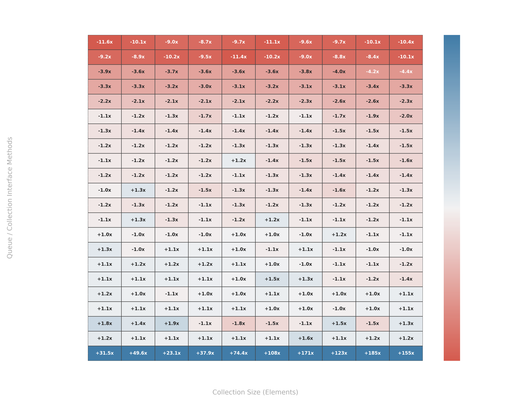
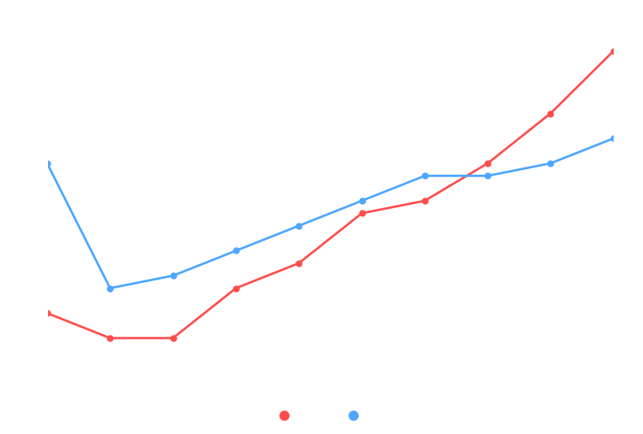
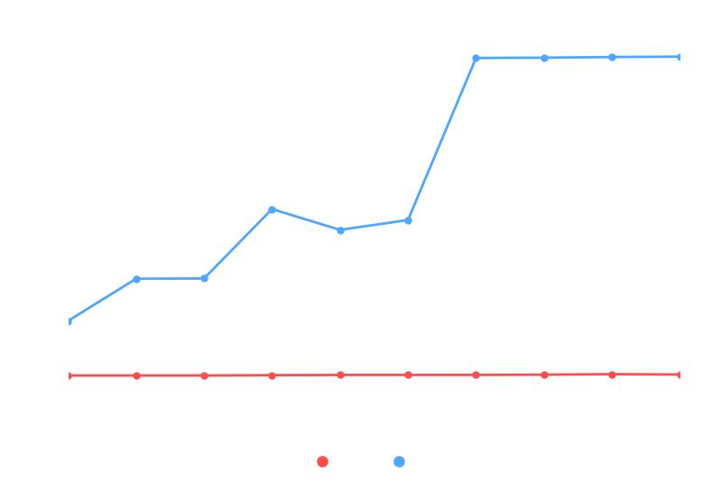
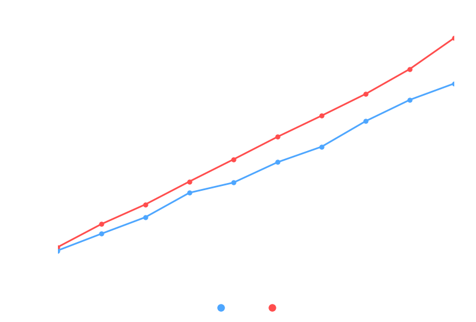
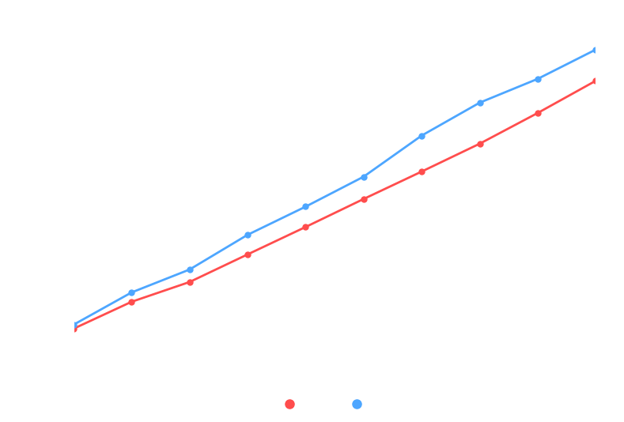
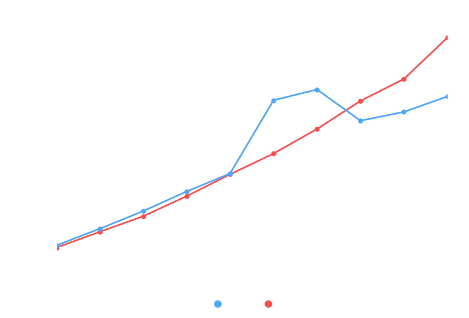
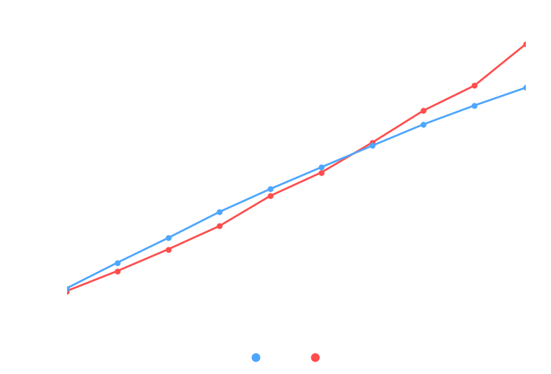
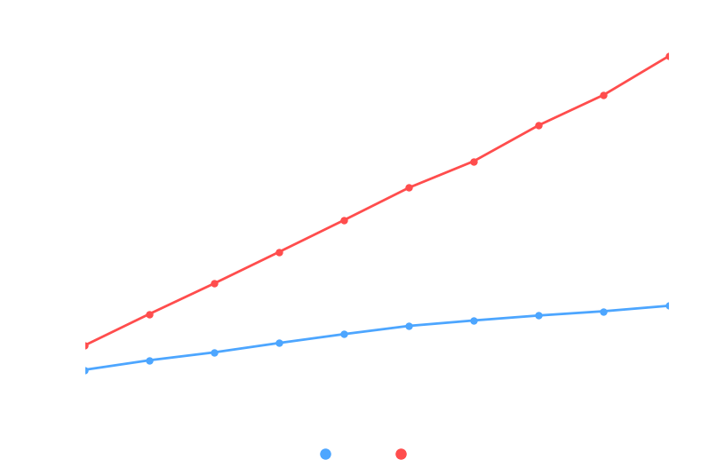
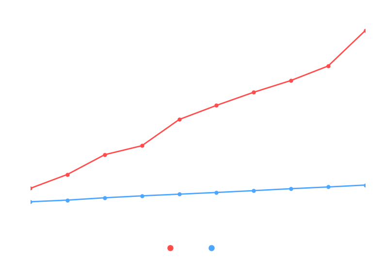
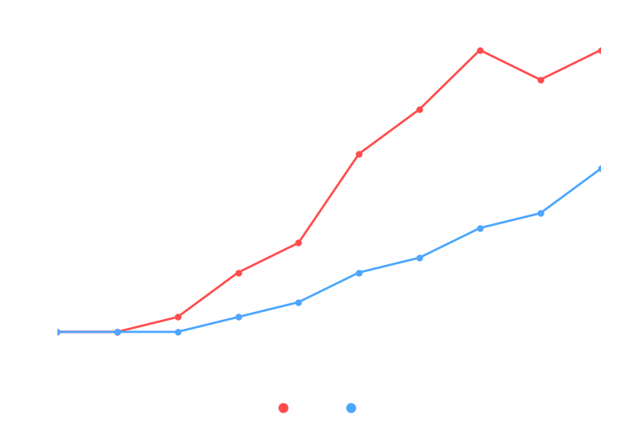
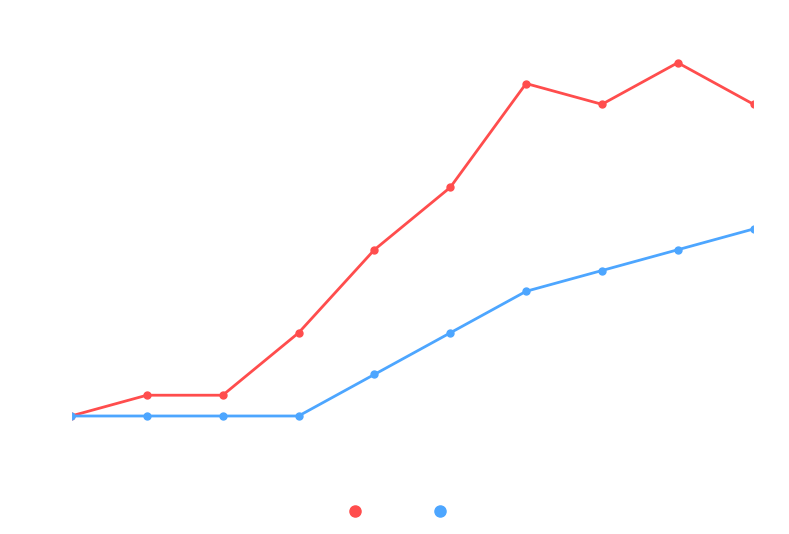
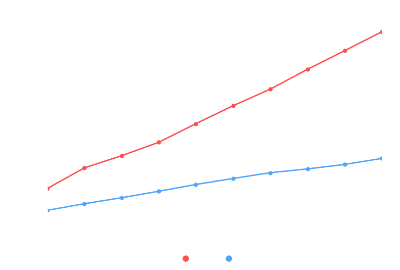
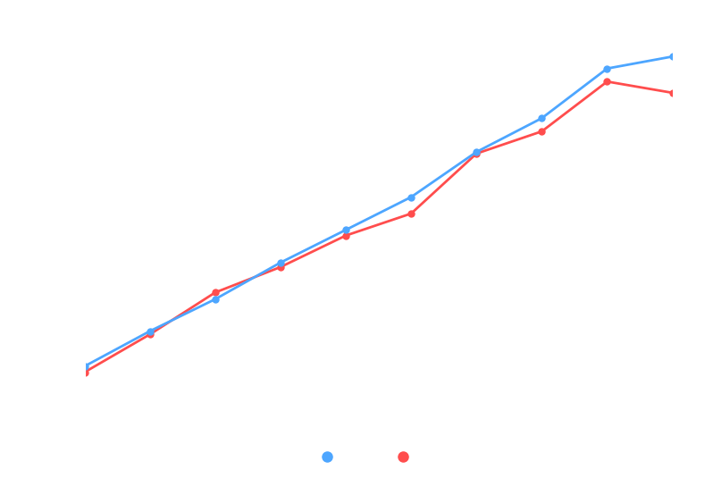
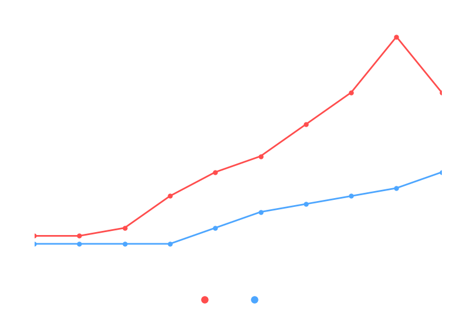
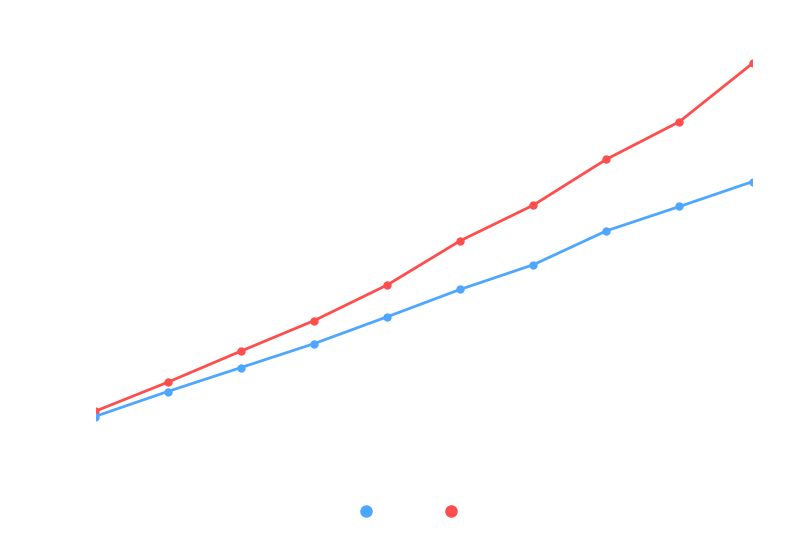
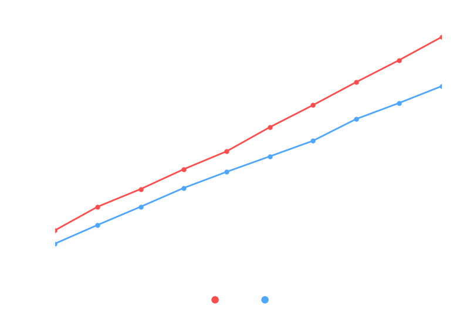
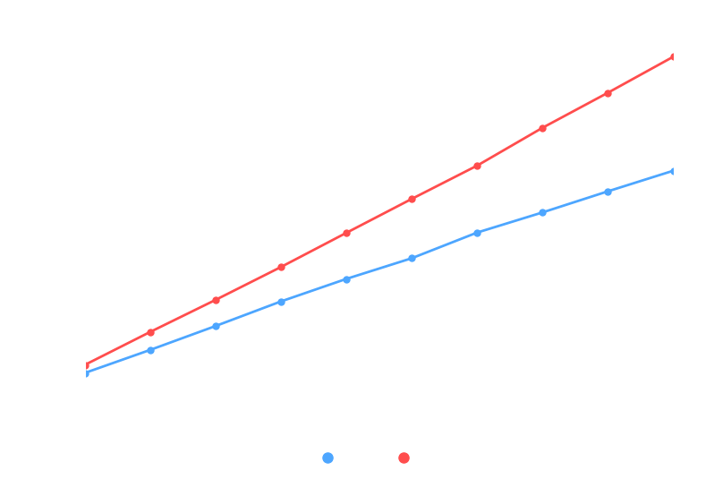
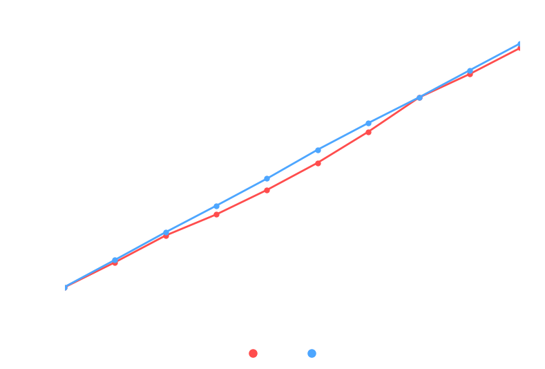
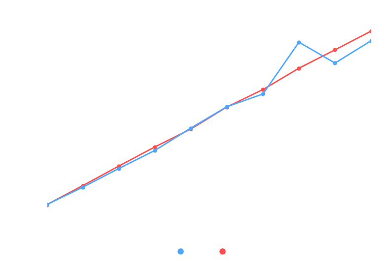
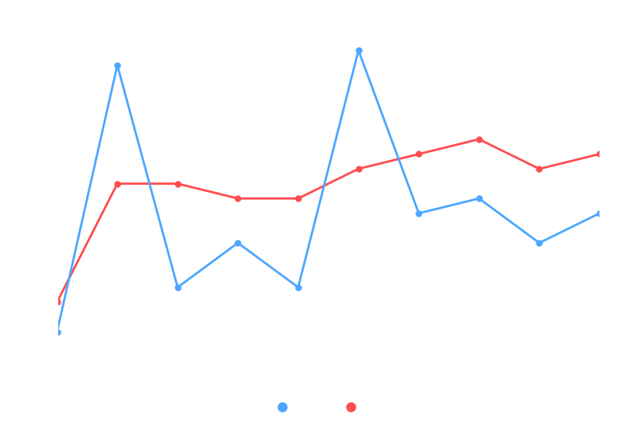
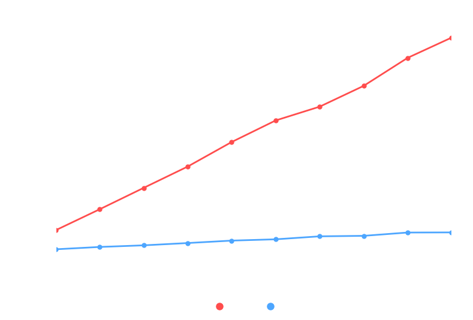
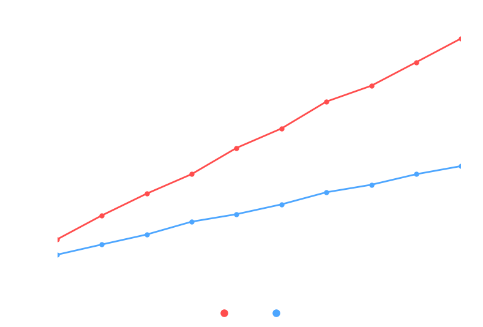
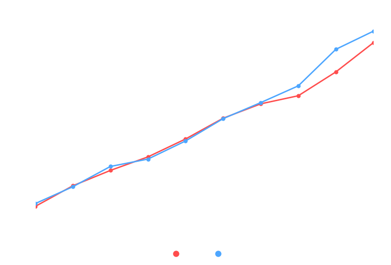